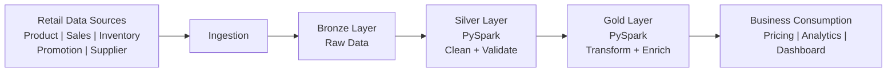
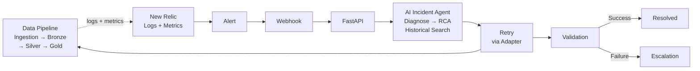

Yes. For a presentation, I would keep the **Data Pipeline** part to 4 slides. The story should be: **why → architecture → processing → failure/monitoring**.

## Slide 1 — Data Pipeline: Business Context

### **Retail Data Pipeline**

**Objective:**  
Build a reliable data pipeline that collects data from multiple retail systems and produces a **clean, business-ready dataset for pricing and promotion decisions**.

**Data Sources**
- Product Database
- Sales Database
- Inventory System/API
- Promotion System/API
- Supplier API

**Business Output**
- Pricing-ready dataset
- Promotion information
- Inventory availability
- Sales insights

**Key challenge:**  
Data comes from heterogeneous systems and can fail or contain invalid/inconsistent records.

---

## Slide 2 — End-to-End Data Pipeline Architecture

### **Bronze → Silver → Gold Architecture**



### Explain it like this:

**1. Ingestion**  
Collect data from different source systems and attach metadata such as `tenant_id`, `run_id`, and ingestion timestamp.

**2. Bronze**  
Store source data in its raw form.

**3. Silver**  
Use **PySpark** to validate, clean, standardize and deduplicate the data.

**4. Gold**  
Use **PySpark** to join and transform datasets according to business rules.

**5. Consumption**  
Provide the final dataset to pricing, analytics and dashboards.

---

## Slide 3 — What Happens Inside the Pipeline?

### **From Raw Data to Business-Ready Data**

Take a product as an example:

```text
Product
P101 | Samsung TV | ₹50,000
             ↓
Sales
P101 | Quantity = 8
             ↓
Inventory
P101 | Stock = 25
             ↓
Promotion
P101 | Discount = 10%
             ↓
        PySpark
             ↓
       GOLD DATASET
```

### Example Gold output

| Field | Value |
|---|---:|
| Product | Samsung TV |
| Base Price | ₹50,000 |
| Discount | 10% |
| Discount Amount | ₹5,000 |
| Final Price | ₹45,000 |
| Inventory | 25 |
| Promotion Active | Yes |

### Key transformations

- Schema validation
- Null handling
- Deduplication
- Data type standardization
- Joins across datasets
- Business-rule calculations
- Data-quality validation

**Result:** A trusted, consumption-ready dataset.

---

## Slide 4 — Monitoring & Failure Handling

### **Making the Data Pipeline Resilient**



### Example incident

**Promotion API timeout**

```text
Promotion API
      ↓
Ingestion Failure ❌
      ↓
New Relic detects failure
      ↓
Alert → Webhook → FastAPI
      ↓
AI Agent investigates
      ↓
Root Cause:
"Promotion API timeout"
      ↓
Retry
      ↓
Pipeline succeeds ✅
      ↓
Silver → Gold
      ↓
Validation
      ↓
Incident Resolved
```

### Key message for presentation

> **The data pipeline is responsible for collecting, processing and delivering trusted business data, while the autonomous incident-management layer continuously monitors the pipeline and helps recover it when failures occur.**
